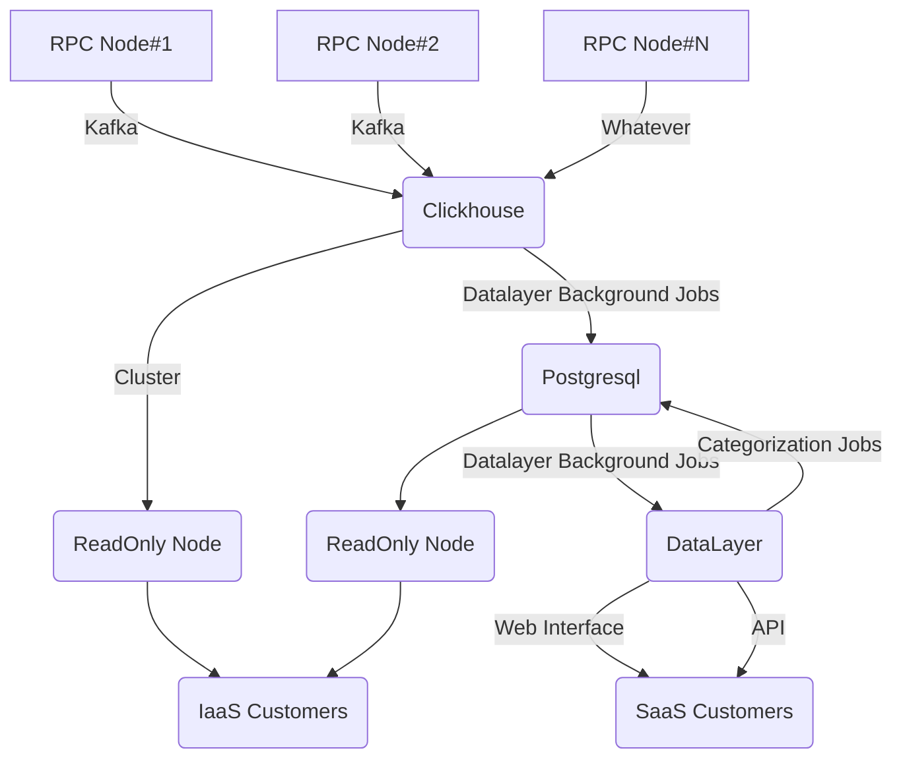

### Overview

**DataLayer** - is a cross-chain analytics tool for dApps developers, market researchers, and investors.

Latest version of web application deployed to [datalayer.xiting.me](https://datalayer.xiting.me)

API Docs available [here](https://datalayer.xiting.me/api-docs)

### How it works




This repository is actual DataLayer Rails web application with background jobs, Web and API interface, PostgreSQL schema and Clickhouse schema

Current implementation supports Everscale Mainnet network and Venom Devnet networks.

### Structure of application

```
app/
  models/
    clickhouse/ <--- Clickhouse representations
    *.rb        <--- PostgreSQL models used by DataLayer
  controllers/
    api/
      v0/
        *.rb    <--- API Controllers
    *.rb        <--- Web interface Controllers
  jobs/
    *.rb        <--- Background Jobs
  serializers/
    *.rb        <--- Serializers for JSON API
  views/
    *.rb        <--- Views for Web Interface

db/
  postgresql_migrate/
    *.rb        <--- PostgreSQL Database migration
  clickhouse_schema.sql <--- Clickhouse schema file
```
